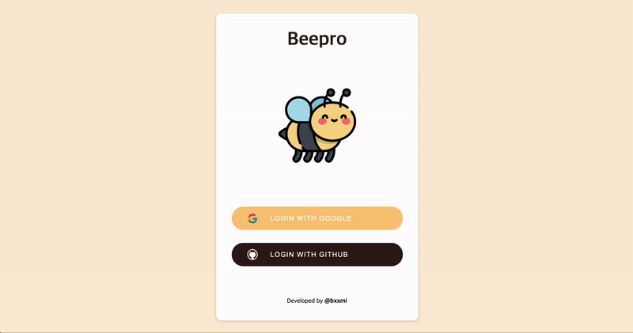

# 🐝 Beepro 

진행 중인 <b>프로젝트 정보를 관리</b>할 수 있는 웹 애플리케이션입니다.

> 🔗 DEMO Site : 

### ⚙️ 기술 스택

* <b>`FRONT END`<b>
  
&nbsp;
&nbsp;

  
* <b>`BACK END`<b>
  

  
* <b>`ETC`<b>
  

 
   
  
### 🖥 주요 기능 화면

  
소셜 로그인

  

  

  
프로젝트 관리

 
  
### 🔖 Docs
  
[Beepro 노션 보러가기](https://unequaled-yuzu-fab.notion.site/Beepro-ae0ca9044ba546d08a62924d5cd95347)
  
### 💭 회고

