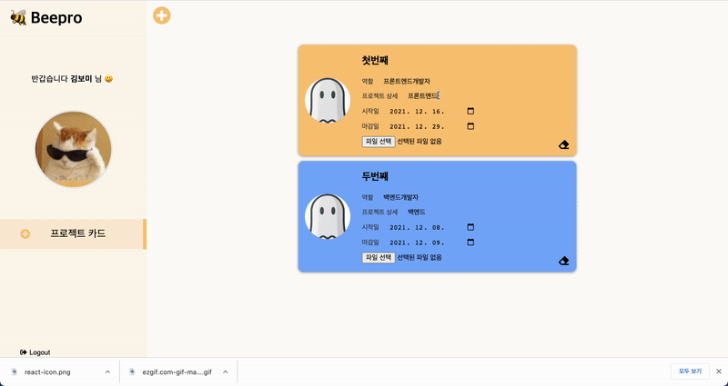
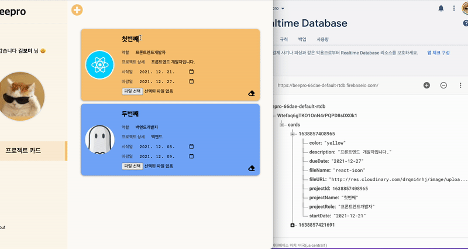
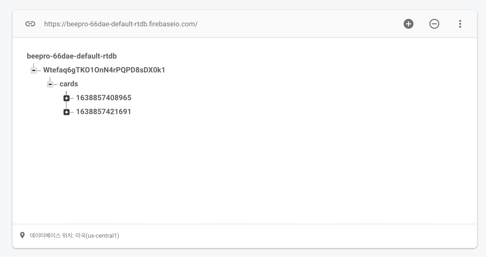

# 🐝 Beepro 

진행 중인 <b>프로젝트 정보를 관리</b>할 수 있는 웹 애플리케이션입니다.

> 🔗 DEMO Site : https://beepro-react.netlify.app/


### ⚙️ 기술 스택

* <b>`FRONT END`</b>
  
&nbsp;
&nbsp;

  
* <b>`BACK END`</b>
  

  
* <b>`ETC`</b>
  

<br/> 
  
### 🖥 주요 기능

* <b>`소셜 로그인`</b>

    * Firebase의 Auth 기능을 활용해서 Google, Github 계정으로 로그인할 수 있습니다.

    * 로그인 즉시 해당 계정의 정보를 받아와 프로필 이미지와 이름이 출력됩니다. 

        <details><summary>화면 보기</summary><div></div></details>

* <b>`프로젝트 관리(CRUD)`</b>
  
    * 진행 중인 프로젝트를 하나의 카드로 만들어 관리할 수 있습니다. (로그인 계정 별)
    
      <details><summary>화면 보기</summary><div></div></details>

    * Update 기능의 경우 처음 생성한 카드의 정보를 실시간으로 변경하고 저장시킬 수 있습니다.
  
      <details><summary>화면 보기</summary><div></div></details>
  
* <b>`Database`</b>

    * 별도의 백엔드 서버 구축 없이 Firebase의 `Real Time Database`를 사용해서 실시간으로 정보를 반영 및 저장할 수 있습니다.

      <details>
        <summary>화면 보기</summary>
          <div>
            
            
          </div>
      </details>

<br />

### 실행 방법

* clone 후 yarn/yarn start

```
$ yarn 
$ yarn start
```
